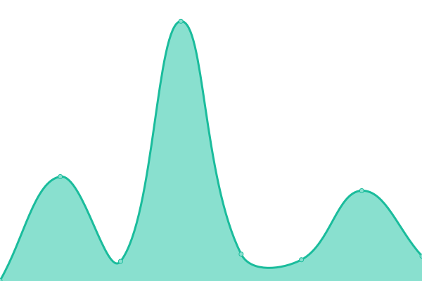

# [📈 Live Status](https://uptime.ammbr.finance): <!--live status--> **🟧 Partial outage**

This repository contains the open-source uptime monitor and status page for [Ammbr Finance](https://ammbr.finance), powered by [Upptime](https://github.com/upptime/upptime).

With [Upptime](https://upptime.js.org), you can get your own unlimited and free uptime monitor and status page, powered entirely by a GitHub repository. We use [Issues](https://github.com/AmmbrFi/status/issues) as incident reports, [Actions](https://github.com/AmmbrFi/status/actions) as uptime monitors, and [Pages](https://uptime.ammbr.finance) for the status page.

<!--start: status pages-->
<!-- This summary is generated by Upptime (https://github.com/upptime/upptime) -->
<!-- Do not edit this manually, your changes will be overwritten -->
<!-- prettier-ignore -->
| URL | Status | History | Response Time | Uptime |
| --- | ------ | ------- | ------------- | ------ |
|  [Ammbr Finance](https://ammbr.finance) | 🟩 Up | [ammbr-finance.yml](https://github.com/AmmbrFi/status/commits/HEAD/history/ammbr-finance.yml) | 

 192ms
     
 | 

<a href="https://uptime.ammbr.finance/history/ammbr-finance">100.00%</a>
    

|  [Ammbr QMM](https://qmm.ammbr.finance) | 🟩 Up | [ammbr-qmm.yml](https://github.com/AmmbrFi/status/commits/HEAD/history/ammbr-qmm.yml) | 

 134ms
     
 | 

<a href="https://uptime.ammbr.finance/history/ammbr-qmm">100.00%</a>
    

|  [Token Bridge](https://swap-beta.ammbr.finance) | 🟥 Down | [token-bridge.yml](https://github.com/AmmbrFi/status/commits/HEAD/history/token-bridge.yml) | 

 116ms
     
 | 

<a href="https://uptime.ammbr.finance/history/token-bridge">100.00%</a>
    

|  [Ammbr NFT](https://nft.ammbr.finance) | 🟩 Up | [ammbr-nft.yml](https://github.com/AmmbrFi/status/commits/HEAD/history/ammbr-nft.yml) | 

 116ms
     
 | 

<a href="https://uptime.ammbr.finance/history/ammbr-nft">100.00%</a>
    

|  [QMM API](https://api.ammbr.finance) | 🟩 Up | [qmm-api.yml](https://github.com/AmmbrFi/status/commits/HEAD/history/qmm-api.yml) | 

 617ms
     
 | 

<a href="https://uptime.ammbr.finance/history/qmm-api">100.00%</a>
    

<!--end: status pages-->

[**Visit our status website →**](https://uptime.ammbr.finance)

## 📄 License

- Powered by: [Upptime](https://github.com/upptime/upptime)
- Code: [MIT](./LICENSE) © [Ammbr Finance](https://ammbr.finance)
- Data in the `./history` directory: [Open Database License](https://opendatacommons.org/licenses/odbl/1-0/)
